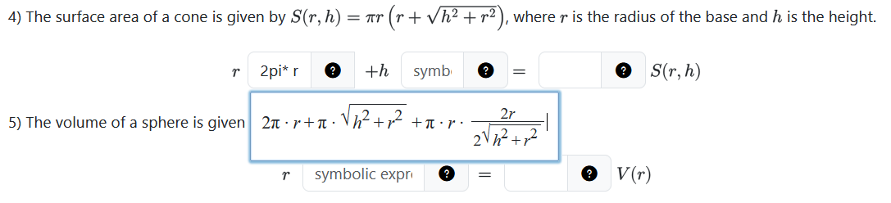

# PrairieLearn Input Plus

A Firefox browser extension that adds Desmos-like functionality to PrairieLearn to help you write complicated mathematical expressions in fixed-width input fields.

The full text in the example input below is `2pi* r+pi*sqrt(h^2+r^2)+pi* r*(2r)/(2sqrt(h^2+r^2))`, but cuts off after 6 characters.\
This extension renders a dynamic-width input field over any focused input field that supports math input, very similar to Desmos.




## Installation

### Prerequisites

- Node.js (v18 or higher)
- npm or yarn
- Firefox browser

### Development Setup

1. **Clone the repository**
   ```bash
   git clone <repository-url>
   cd prairielearn-input-plus
   ```

2. **Install dependencies**
   ```bash
   npm install
   ```

3. **Build the extension**
   ```bash
   npm run build
   ```
   This will create a `dist` folder with the compiled extension.

4. **Load the extension in Firefox**
   - Open Firefox and navigate to `about:debugging#/runtime/this-firefox`
   - Click "Load Temporary Add-on"
   - Navigate to the `dist` folder in your project
   - Select the `manifest.json` file

5. **Test the extension**
   - Visit any webpage
   - The extension will inject a React component when you focus on text input fields matching `.form-control[type='text']`

### Development Mode

To automatically rebuild the extension when you make changes:

```bash
npm run dev
```

After making changes, you'll need to reload the extension in Firefox:
- Go to `about:debugging#/runtime/this-firefox`
- Click "Reload" next to your extension

## Project Structure

```
├── src/
│   └── content/
│       ├── index.tsx           # Content script entry point
│       ├── MathInput/
│       │   └── MathInput.tsx   # Main React component
│       └── SampleComponent.tsx # Sample component
├── dist/                       # Built extension (generated)
├── manifest.json               # Firefox extension manifest
├── vite.config.ts             # Vite bundler configuration
└── package.json               # Project dependencies
```

## Tech Stack

- **React 19** - UI framework
- **TypeScript** - Type safety
- **Vite** - Fast bundling
- **Firefox WebExtensions API** - Browser extension APIs

## Building for Production

```bash
npm run build
```

The production-ready extension will be in the `dist` folder.
